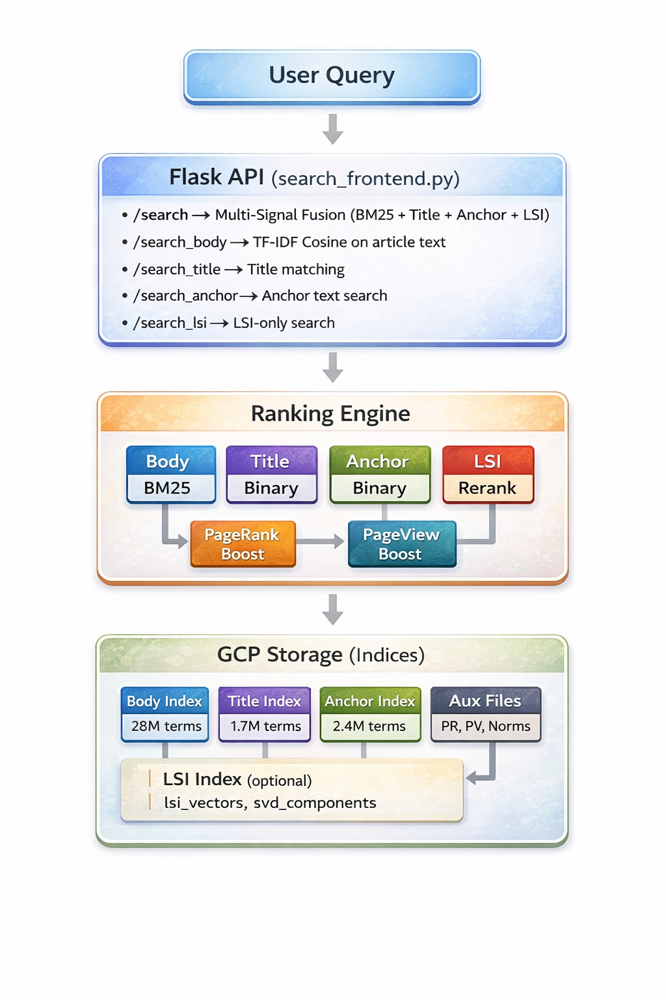
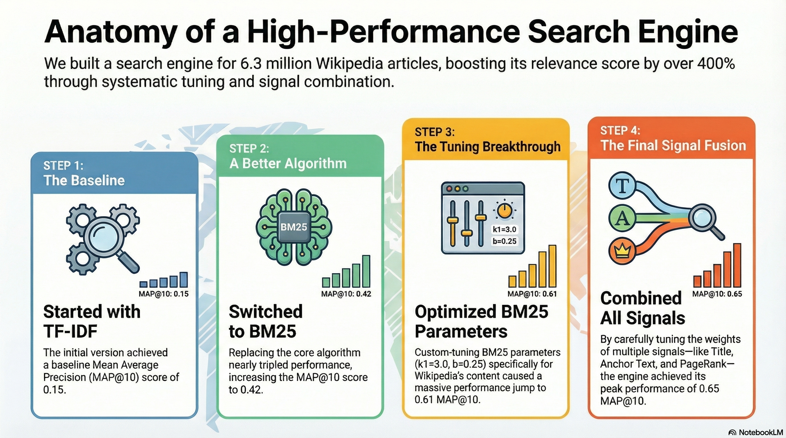
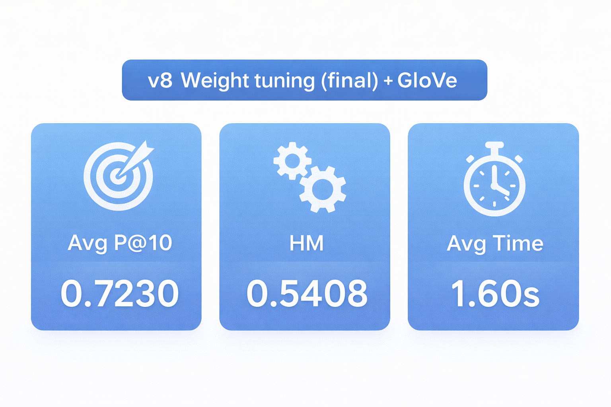

# 🔍 Wikipedia Search Engine

> **Information Retrieval Course Project** | A high-performance full-text search engine for English Wikipedia (6.3M articles)


---
## 👥 Authors

<div align="center">

### ✨ Project Creators ✨

  <tr>
    <td align="center">
      
    </td>
    <td align="center">
      
    </td>
  </tr>


<br/>
<p align="center">
  
</p>


&nbsp;


</div>

---

## 📖 Overview

A complete search pipeline for the English Wikipedia corpus featuring:
- **Multi-signal ranking** combining text relevance, link analysis, and popularity metrics
- **BM25 probabilistic ranking** with tuned parameters
- **GloVe semantic reranking** using document embeddings
- **6.3M documents** indexed across body, title, and anchor text
- **~2.3s query latency** with lazy index loading
- **RESTful API** for easy integration

---

## 🏗️ Architecture
<br/>
<p align="center">
  
</p>

---

## 📁 Project Structure
```
IR_Project/
├── search_frontend.py        # Flask REST API
├── search_runtime.py         # Search engine core logic
├── config.py                 # Configuration & weights
├── inverted_index_gcp.py     # Inverted index with GCP support
├── text_processing.py        # Tokenization & stemming
├── parser_utils.py           # Wikipedia XML parsing utilities
│
├── indexing/
│   └── build_indices.py      # Index construction pipeline
│
├── ranking/
│   ├── bm25.py               # BM25 implementation
│   ├── tfidf_cosine.py       # TF-IDF cosine similarity
│   └── merge.py              # Score fusion
│
├── scripts/
│   ├── build_glove_doc_embeddings.py # Build GloVe document embeddings
│   └── tune_glove_hyperparameters.py # GloVe parameter tuning
│
└── experiments/
    ├── evaluate.py           # Average Precision@K, Precision, Recall metrics
    ├── run_evaluation.py     # Main evaluation script
    ├── bm25_tuning.py        # BM25 parameter optimization
    ├── weight_tuning.py      # Multi-signal weight optimization
    └── compare_versions.py   # Version comparison & visualization
```

---
<br/>
<p align="center">
  
</p>

---

## 🖥️ UI (Web Interface)

A lightweight web UI is included for interactive querying and quick inspection of results.
The UI connects directly to the Flask backend running on:

**http://104.198.58.119:8082**

The backend serves the same search endpoints described above and does not modify
the ranking logic—only provides a convenient web-based interface.

<br/>
<p align="center">
  
</p>


## 🚀 API Endpoints

### Main Search (Recommended)
```bash
GET /search?query=<query>
```
Multi-signal fusion combining all ranking signals + GloVe reranking.

**Response:**
```json
[
  [12345, "Article Title"],
  [67890, "Another Article"],
  ...
]
```

### Specialized Endpoints

| Endpoint | Method | Description |
|----------|--------|-------------|
| `/search` | GET | 🏆 Main engine - BM25 + Title + Anchor + PageRank + PageView + GloVe |
| `/search_body` | GET | TF-IDF Cosine similarity on article body |
| `/search_title` | GET | Binary title matching |
| `/search_anchor` | GET | Binary anchor text search |
| `/search_with_weights` | GET | Custom weight configuration |
| `/get_pagerank` | POST | Get PageRank scores for doc IDs |
| `/get_pageview` | POST | Get page view counts for doc IDs |

### Custom Weight Search
```bash
GET /search_with_weights?query=<query>&body_weight=1.0&title_weight=0.35&anchor_weight=0.25&pagerank_boost=0.15
```

### PageRank & PageView Endpoints

#### Get PageRank Scores
Returns PageRank values for a list of Wikipedia article IDs.

**Endpoint:** `POST /get_pagerank`

**Request:**
```bash
curl -X POST "http://<SERVER_IP>:8080/get_pagerank" \
  -H "Content-Type: application/json" \
  -d '[12345, 67890, 11111]'
```

**Response:**
```json
[0.000123, 0.000456, 0.000789]
```

**Python Example:**
```python
import requests

# Get PageRank for specific documents
doc_ids = [12345, 67890, 11111]
response = requests.post(
    "http://<SERVER_IP>:8080/get_pagerank",
    json=doc_ids
)
pagerank_scores = response.json()
# Returns: [0.000123, 0.000456, 0.000789]
```

#### Get PageView Counts
Returns the number of page views that each Wikipedia article had in August 2021.

**Endpoint:** `POST /get_pageview`

**Request:**
```bash
curl -X POST "http://<SERVER_IP>:8080/get_pageview" \
  -H "Content-Type: application/json" \
  -d '[12345, 67890, 11111]'
```

**Response:**
```json
[15234, 8921, 4567]
```

**Python Example:**
```python
import requests

# Get page views for specific documents
doc_ids = [12345, 67890, 11111]
response = requests.post(
    "http://<SERVER_IP>:8080/get_pageview",
    json=doc_ids
)
pageview_counts = response.json()
# Returns: [15234, 8921, 4567]
```

**Note:** If a document ID is not found, the endpoint returns `0.0` for PageRank or `0` for PageView.

---

## ⚙️ Ranking Algorithms

### BM25 Scoring (Main Search - Body Component)
```
score(D, Q) = Σ IDF(qi) · (tf(qi, D) · (k1 + 1)) / (tf(qi, D) + k1 · (1 - b + b · |D|/avgdl))
```

**Parameters:**
| Parameter | Description | Default |
|-----------|-------------|---------|
| `k1` | Term frequency saturation | 3.0 |
| `b` | Document length normalization | 0.25 |

### TF-IDF Cosine Similarity (`/search_body` Endpoint)
```
score(D, Q) = (D · Q) / (||D|| · ||Q||)
```
Where D and Q are TF-IDF weighted vectors.

### Binary Scoring (Title & Anchor)
```
score(D, Q) = number of query terms found in document
```

### Multi-Signal Fusion (`/search` Endpoint)
```
score(d, q) = w_body · BM25(d, q) + w_title · title(d, q) + w_anchor · anchor(d, q) 
            + w_pr · log(1 + PR(d)) + w_pv · log(1 + PV(d)) + β · cos(E_q, E_d)
```

Where:
- `E_q` = query embedding (average of top-k document embeddings)
- `E_d` = document embedding (GloVe weighted average)
- `β` = GloVe weight (2.7)

**Default Weights:**
| Signal | Weight | Method |
|--------|--------|--------|
| Body | 0.4 | BM25 |
| Title | 0.75 | Binary |
| Anchor | 1.0 | Binary |
| PageRank | 0.15 | Log boost |
| PageView | 0.10 | Log boost |
| GloVe | 2.7 | Cosine similarity |

---

## 📊 Index Statistics

| Index | Terms | Documents | Size |
|-------|-------|-----------|------|
| Body | 28M | 6.3M | ~9 GB |
| Title | 1.7M | 6.3M | ~211 MB |
| Anchor | 2.4M | 5.8M | ~1.1 GB |
| GloVe Embeddings | - | 6.3M | ~2.5 GB |
| PageRank | - | 6.3M | ~85 MB |
| PageViews | - | 6.3M | ~74 MB |
| Titles | - | 6.3M | ~169 MB |
| **Total** | - | - | **~13.3 GB** |

---

## 🛠️ Installation & Setup

### Prerequisites
```bash
pip install -r requirements.txt
```

### Running Locally
```bash
# Set up configuration
export GOOGLE_APPLICATION_CREDENTIALS="path/to/credentials.json"

# Start server
python search_frontend.py
```

### GCP Deployment
```bash
# SSH to instance
gcloud compute ssh <instance-name> --zone=us-central1-c

# Activate environment
source ~/venv/bin/activate
cd ~/IR_Project

# Run server
nohup python search_frontend.py > ~/frontend.log 2>&1 &
```

---

## 🔨 Building GloVe Indices

### Build GloVe Document Embeddings
```bash
python scripts/build_glove_doc_embeddings.py \
  --glove-path /path/to/glove.6B.300d.txt \
  --dim 300 \
  --top-m 100
```

**Note:** Download GloVe vectors from https://nlp.stanford.edu/projects/glove/
Recommended: `glove.6B.300d.txt` (6B tokens, 300 dimensions)

### Enabling GloVe
Edit `config.py`:
```python
# GloVe semantic features configuration
ENABLE_GLOVE = True  # Enable GloVe reranking
GLOVE_BETA = 2.7  # GloVe weight: final = base_score + beta * cosine
GLOVE_CANDIDATE_POOL = 150  # Candidates to consider
GLOVE_TOP_K = 12  # Number of top documents to use for query embedding
```

After updating config, restart the server for changes to take effect.

---

## 📈 Evaluation & Tuning

### Running Evaluation
```bash
python experiments/run_evaluation.py --base-url http://<SERVER_IP>:8080
```

### BM25 Parameter Tuning
```bash
python experiments/bm25_tuning.py --base-url http://<SERVER_IP>:8080
```
Outputs heatmaps and sensitivity plots to `experiments/bm25_tuning_results/`.

### Weight Tuning
```bash
python experiments/weight_tuning.py --base-url http://<SERVER_IP>:8080
```
Tests hundreds of weight combinations and generates visualization reports.

### GloVe Hyperparameter Tuning
```bash
python scripts/tune_glove_hyperparameters.py --server-ip <SERVER_IP>
```
Grid search over β (weight) and top-k (documents for query embedding).

### Version Comparison
```bash
python experiments/compare_versions.py --base-url http://<SERVER_IP>:8080
```
Compares different search engine configurations and generates comparison visualizations.

### Metrics
- **Average Precision@10** - Average of Precision@10 across queries
- **Average Precision@5** - Average of Precision@5 across queries
- **Precision@5** - Precision at rank 5
- **F1@30** - F1 score at rank 30
- **Harmonic Mean** - Combined P@5 and F1@30

---

## 📂 Data Directory Structure
```
data/
├── indices/
│   ├── body/           # Body inverted index
│   │   ├── body.pkl
│   │   └── *.bin       # Posting lists
│   ├── title/          # Title inverted index
│   └── anchor/         # Anchor text inverted index
│
└── aux/
    ├── doc_norms.pkl   # TF-IDF normalization factors
    ├── doc_len.pkl     # Document lengths (for BM25)
    ├── avgdl.txt       # Average document length
    ├── pagerank.pkl    # PageRank scores (6.3M entries)
    ├── pageviews.pkl   # Page view counts
    ├── titles.pkl      # doc_id → title mapping
    └── glove_doc_embeddings.pkl  # GloVe document embeddings
```

---

## 🔧 Configuration

Edit `config.py` to customize:
```python
# Index paths
BODY_INDEX_DIR = "indices/body"
TITLE_INDEX_DIR = "indices/title"
ANCHOR_INDEX_DIR = "indices/anchor"

# BM25 parameters
BM25_K1 = 3.0
BM25_B = 0.25

# Ranking weights
BODY_WEIGHT = 0.4
TITLE_WEIGHT = 0.75
ANCHOR_WEIGHT = 1.0
PAGERANK_BOOST = 0.15
PAGEVIEW_BOOST = 0.10

# GloVe semantic features configuration
ENABLE_GLOVE = True   # Enable GloVe reranking
GLOVE_BETA = 2.7      # GloVe weight
GLOVE_CANDIDATE_POOL = 150  # Candidates to consider
GLOVE_TOP_K = 12      # Top docs for query embedding
```

---

## 📊 Performance

<br/>
<p align="center">
  
</p>

---

## 🧪 Example Queries

> Replace `<SERVER_IP>` with your instance IP (e.g., `104.198.58.119`)
```bash
# Main search (BM25 + all signals + GloVe)
curl "http://<SERVER_IP>:8080/search?query=machine+learning"

# Body search (TF-IDF Cosine)
curl "http://<SERVER_IP>:8080/search_body?query=artificial+intelligence"

# Title search (Binary)
curl "http://<SERVER_IP>:8080/search_title?query=python+programming"

# Custom weights
curl "http://<SERVER_IP>:8080/search_with_weights?query=deep+learning&title_weight=3.0&body_weight=0.5"

# Get PageRank for documents
curl -X POST "http://<SERVER_IP>:8080/get_pagerank" \
  -H "Content-Type: application/json" \
  -d '[12345, 67890, 11111]'

# Get PageViews for documents
curl -X POST "http://<SERVER_IP>:8080/get_pageview" \
  -H "Content-Type: application/json" \
  -d '[12345, 67890, 11111]'
```

---

## 📚 References

- Robertson, S., & Zaragoza, H. (2009). *The Probabilistic Relevance Framework: BM25 and Beyond*
- Page, L., et al. (1999). *The PageRank Citation Ranking: Bringing Order to the Web*
- Pennington, J., Socher, R., & Manning, C. D. (2014). *GloVe: Global Vectors for Word Representation*

---

## 📄 License

This project is for educational purposes only.
